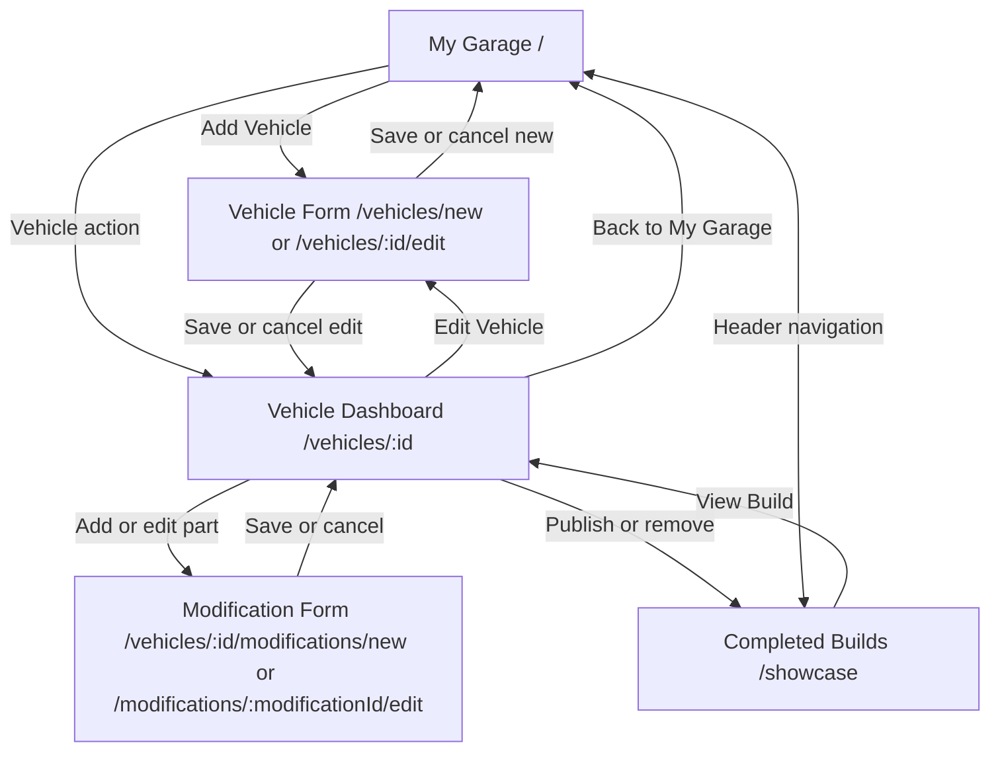

# 2. Wireframes & Component Breakdown — Current BuildSpec

These sketches describe the React interface currently implemented. They show content order and interactions; exact typography and colors are in [03-design-system.md](03-design-system.md).

## Screen map



The header is shared across routes. It contains Garage and Showcase links, a centered BuildSpec wordmark, all-build paid/total parts cost, and a theme toggle. The narrow layout replaces navigation links with a menu button and drawer. Every page ends with the shared footer.

## 1. My Garage (`/`)

```text
Desktop: page title + Add Vehicle
         two-column vehicle grid
         ┌ photo ────────────┐ ┌ photo ────────────┐
         │ year/make/model   │ │ year/make/model   │
         │ nickname, variant │ │ nickname, variant │
         │ progress bar      │ │ progress bar      │
         │ planned/purchased │ │ planned/purchased │
         │ spent + next action││ spent + next action│
         └───────────────────┘ └───────────────────┘
Phone:   title → Add Vehicle → one vehicle card per row
```

The card action varies with the build: Start Build, Install Purchased, Review Planned, or View Completed Build. Its action link opens the dashboard. A missing photo displays a letter placeholder. The page has loading, retryable error, and first-vehicle empty states.

## 2. Completed Builds (`/showcase`)

```text
Title: Completed Builds                         published count
┌ final vehicle portrait ──────────────────────────────────────┐
│ Completed build · year/make/model · completion date          │
│ installed parts · paid cost                       View Build  │
└──────────────────────────────────────────────────────────────┘
```

Cards appear only for vehicles that remain eligible and are explicitly published. The page has loading, retryable error, and no-published-build states. Cards lead to their vehicle dashboards. On phones, covers become one column.

## 3. Vehicle Form (`/vehicles/new`, `/vehicles/:id/edit`)

```text
Back link → Add Vehicle / Edit Vehicle
Vehicle identity: Make* | Model* | Year* | Nickname
Expandable specifications: Variant | Engine | Transmission | Color
Expandable vehicle photo: preview + Choose or take photo
Validation summary / request error / draft note
Cancel                                    Save Vehicle
```

Create mode restores and saves an unsent draft on this device; edit mode loads the existing vehicle. A successful create returns to Garage, and a successful edit returns to that dashboard. Cancel follows the same route pattern. Fields form two columns on wide screens and one on phones. The photo uploads immediately, while the resulting URL is saved with the form.

## 4. Vehicle Dashboard (`/vehicles/:id`)

```text
Back to My Garage
Large vehicle photo with year/make/model, nickname, specs, Edit Vehicle
Build overview: paid so far + installed progress bar
Installed | Purchased | Planned | Total mods | All parts cost
Completed build archive: checklist + final portrait + Publish/Remove
Modifications: Add Modification
  Search | Status | Category | Sort | result count | Clear filters
  Part card: optional photo, status, name, brand/category, price,
             notes, next-status action, Edit, Delete
Vehicle settings: Delete Vehicle
```

The desktop stats form a five-column row. At phone widths the filters sit behind **More filters**, modification cards stack, and a sticky bottom bar holds **Add Modification**. A part can be marked Purchased immediately. Marking it Installed opens a dialog for date and optional fitted-part photo. Delete actions open a confirmation dialog. The archive panel only enables publication after at least one part exists, all tracked parts are Installed, and a final photo has been saved. There are separate empty states for no parts and no filter matches, plus loading and error feedback.

## 5. Modification Form (`/vehicles/:id/modifications/new`, `/modifications/:modificationId/edit`)

```text
Back to Vehicle Dashboard → Add Modification / Edit Modification
Part details: Name* | Brand | Category* | Price (PHP)*
Build progress: Status* | Purchase date | Installer/shop
If Installed: Install date* | installed-part photo
Expandable Notes
Validation summary / request error / draft note
Cancel                              Save Modification
```

New modifications default to Planned and retain an unsent per-vehicle draft in local storage. The edit route fetches the part and its parent vehicle. Save and Cancel return to the vehicle dashboard. On phones, all controls stack. The installation date cannot be in the future.

## Current component breakdown

| Component/function | Responsibility |
| --- | --- |
| `AppLayout`, `HeaderTotals` | Shared header, navigation drawer, theme, toast, route content, footer, aggregate costs. |
| `GaragePage`, `VehicleCard`, `VehicleImage` | Vehicle list, progress summaries, photos and placeholders. |
| `ShowcasePage`, `ShowcaseCover` | Published build list and cover cards. |
| `VehicleFormPage`, `ModificationFormPage` | Create/edit state, validation, drafts, submissions. |
| `VehicleDashboardPage`, `CompletionPanel` | Selected build, derived statistics, filters, publication state, and mutations. |
| `ModificationCard`, `Stat`, `InstallDialog`, `Dialog` | Part actions, metrics, install details, and confirmations. |
| `Button`, `Field`, `PhotoUpload`, `ErrorSummary`, `PageState` | Shared controls and feedback patterns. |

The app uses page-local React state for loaded records and UI controls. The Express API and PostgreSQL hold saved data. Form drafts and the theme are the only browser-persisted UI state.
