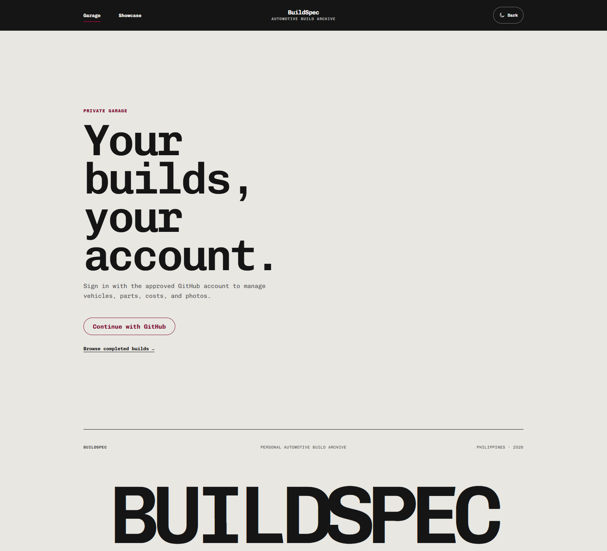
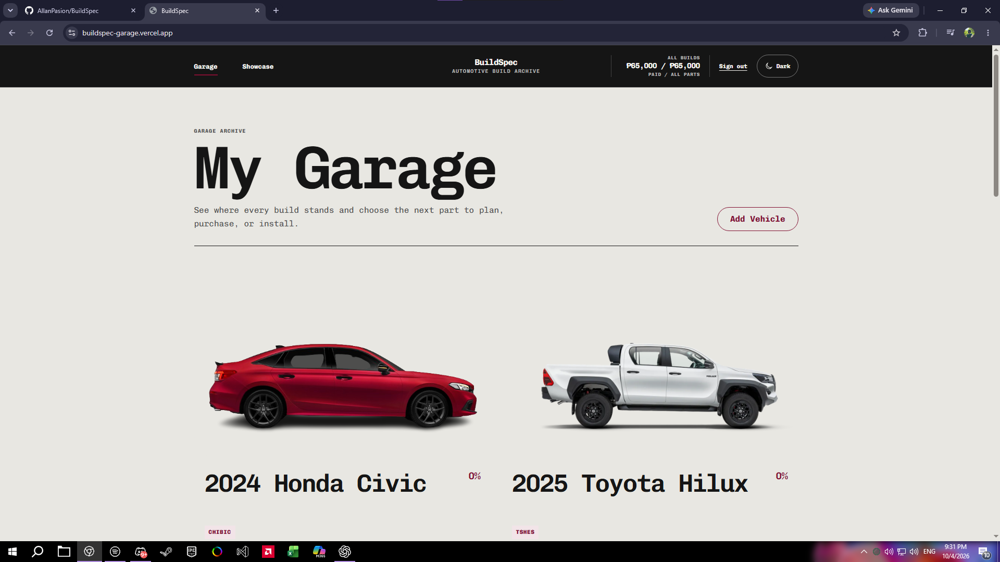
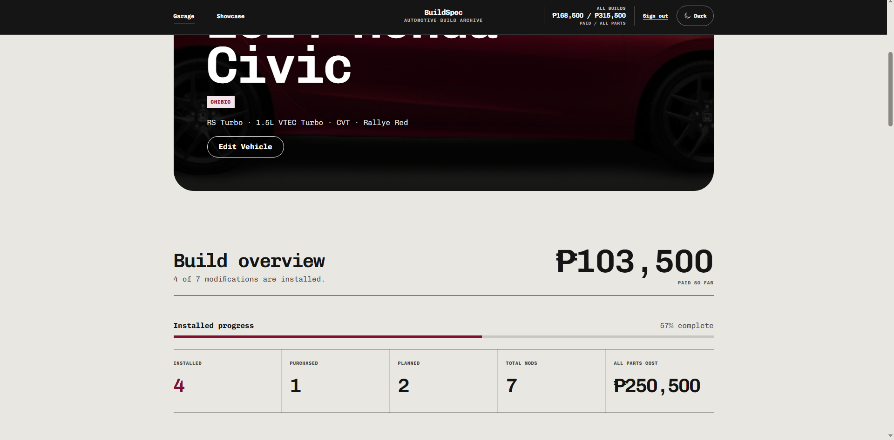
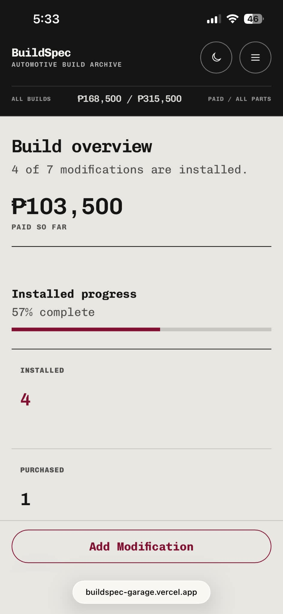

# BuildSpec

[](AI-USAGE.md)

I designed and directed BuildSpec and wrote the features identified in [AI usage and authorship](AI-USAGE.md). I sent my code to Codex for checking and polish; Codex also built other parts of the app and helped with documentation.

## 1. Overview

BuildSpec is a personal car modification tracker. It helps me plan parts for multiple vehicles, record what I have purchased and installed, see how much I have paid versus the full planned cost, and share completed builds. The garage is private to the approved GitHub account; the completed-build showcase is public.

### Built with

- React, React Router, and Vite for the website.
- Express, Prisma, and PostgreSQL for the API and saved records.
- GitHub OAuth and server-side sessions for owner access.
- Local photo storage for development or a private Supabase Storage bucket for hosted photos.
- Vercel for the combined website and API deployment.

### Screenshots

**Owner sign-in** — garage editing is private, while visitors can browse completed builds without signing in.



**My Garage** — signed-in overview of vehicles, build progress, and the paid versus all-parts totals.



**Vehicle build overview** — paid spending, installed progress, and modification counts for one car.



**Phone layout** — the same build overview reflows into a single column with a large Add Modification control.



These screenshots were taken at different points while the builds were being updated, so the spending totals are not identical in every image.

## 2. Setup and installation

### Prerequisites

- Node.js, npm, and Git.
- A local PostgreSQL database or a Supabase PostgreSQL connection.
- PostgreSQL client tools, including `pg_dump`; the migration command backs up the database first.
- A GitHub OAuth App for the account that will manage the garage.
- A private Supabase Storage bucket named `buildspec-photos` if using hosted photo storage.

### Get the code and install dependencies

```bash
git clone https://github.com/AllanPasion/BuildSpec.git
cd BuildSpec
npm ci
npm --prefix server ci
npm --prefix client ci
```

### Configure the API and website

Create an empty PostgreSQL database, then copy `server/.env.example` to an untracked `server/.env` (or use `server/.env.supabase.example` for hosted storage). The templates show example values for every setting:

- **Required:** Set `DATABASE_URL`, `GITHUB_CLIENT_ID`, `GITHUB_CLIENT_SECRET`, and `GITHUB_ALLOWED_USER_ID` for the account that can edit the garage.
- **Local defaults:** `PORT=3000`, `CLIENT_URL=http://localhost:5173`, `GITHUB_CALLBACK_URL=http://localhost:3000/api/auth/github/callback`, `COOKIE_SAME_SITE=lax`, and `PHOTO_STORAGE=local`.
- **Hosted photos:** Set `PHOTO_STORAGE=supabase`, `SUPABASE_URL`, and `SUPABASE_SECRET_KEY`. If the API has a separate origin, set `VITE_API_URL` in `client/.env`; leave it unset for this project's single-origin deployment.

Keep credentials out of Git and `VITE_` variables. For local OAuth, set the GitHub App homepage to `http://localhost:5173` and callback to `http://localhost:3000/api/auth/github/callback`. Production needs its own callback; see [deployment setup](docs/DEPLOYMENT.md).

### Database setup

From the project root, apply the committed Prisma migrations:

```bash
npm --prefix server run db:deploy
```

That command runs `pg_dump` before applying migrations. To add a sample vehicle and parts to an empty database, optionally run `npm --prefix server run db:seed`. Do not seed a database that already contains your own builds.

### Run locally

```bash
npm run dev
```

Open `http://localhost:5173`. The API listens at `http://localhost:3000` by default; `http://localhost:3000/api/health` is its health check. Sign in with the approved GitHub account to edit the garage, or visit `/showcase` without signing in. The root command starts both servers and reports if either port is occupied. Stop them with Ctrl+C.

If the API and website use different origins, set `CLIENT_URL` in `server/.env` and `VITE_API_URL` in `client/.env`. Restart after changing environment variables.

## 3. Features and usage

### Main workflow

1. Sign in and add a vehicle to **My Garage**, including a garage photo if available.
2. Open its dashboard and add modifications with a name, category, price, and Planned, Purchased, or Installed status.
3. Mark a part purchased and then installed; record an installation date and optionally upload a photo of the fitted part.
4. Review installed progress, paid spending, and the cost of all planned parts. Search, filter, and sort the modification list as the build changes.
5. Once every tracked part is installed, add a final build portrait and explicitly publish the vehicle to the public **Completed Builds** showcase. You can unpublish it later.

The interface also includes phone navigation, light and dark themes, form validation, delete confirmations, and loading and error states. The main website routes are `/`, `/showcase`, `/vehicles/new`, `/vehicles/:id`, and the related vehicle and modification edit routes.

### Main API endpoints

| Method | Path | Purpose |
| --- | --- | --- |
| `GET` | `/api/health` | Check API status. |
| `GET` | `/api/vehicles/showcase/published` | List published builds publicly. |
| `GET` / `POST` | `/api/vehicles` | List the owner's vehicles or add one. |
| `GET` / `PUT` / `DELETE` | `/api/vehicles/:id` | View, update, or remove a vehicle. |
| `PATCH` | `/api/vehicles/:id/showcase` | Publish or unpublish an eligible build. |
| `POST` | `/api/modifications` | Add a part to a vehicle. |
| `GET` / `PUT` / `DELETE` | `/api/modifications/:id` | View, change, or remove a part. |
| `POST` | `/api/uploads/sign` | Authorize a hosted photo upload. |
| `GET` | `/api/auth/me` | Check the current owner session. |

Except for the health check and published showcase, vehicle, modification, and upload operations require owner authentication. The API accepts JPG, PNG, and WebP photos up to 8 MB.

## 4. Project structure

```text
client/               React website, routes, styling, and static assets
server/               Express API, GitHub OAuth, Prisma schema, and migrations
api/                  Vercel entry point for the Express API
scripts/              Local development port check
docs/                 Proposal, wireframes, design system, reports, and deployment notes
AI-USAGE.md           AI-use and authorship record
vercel.json           Production build and route configuration
```

### Architecture

The React website calls the Express API. Prisma stores vehicles, modifications, and owner sessions in PostgreSQL. In hosted mode, the API authorizes direct uploads to a private Supabase bucket and controls photo reads; local development can store photos in `server/uploads/`. Vercel serves the website and routes `/api/*` and `/uploads/*` to Express.

## 5. Tests and build

```bash
npm --prefix server test
npm --prefix server run check
npm --prefix client run lint
npm --prefix client run build
```

On October 4, 2026, the five server authentication tests, server syntax check, and client production build passed. Client lint completed with one React effect warning in `client/src/App.jsx`. The build writes production files to `client/dist/`; full automated coverage of vehicle, modification, and publication flows is still to do.

## 6. Deploy to Vercel

The project's configured production address is [buildspec-garage.vercel.app](https://buildspec-garage.vercel.app). The root [`vercel.json`](vercel.json) installs the root, server, and client dependencies, builds the Vite website, and routes API and photo requests to Express. Leave `VITE_API_URL` unset for this single-origin deployment.

Set the private database, storage, GitHub OAuth, and callback values in Vercel Project Settings. Register a production GitHub OAuth App for the exact deployed callback. The full environment list, photo migration notes, and release checks are in [deployment setup](docs/DEPLOYMENT.md). Do not place server secrets in the browser build.

## 7. Known limits

- Production sign-in, sign-out, existing photos, and public pages have been checked, but new vehicle and photo uploads, modification writes, and showcase publishing still need complete hands-on production checks.
- The migration backup covers PostgreSQL and local upload files, not later photos in Supabase Storage. Back up the private bucket separately.
- Automated tests cover authentication; the main build-management flows need more tests.
- On October 4, 2026, `npm --prefix server audit --omit=dev` reported four high-severity findings in the server dependency tree. Their impact has not yet been triaged.

## What I would do next

- Test a complete add-vehicle → add-part → upload-photo → publish flow in production.
- Add automated checks for modification status changes, cost totals, and publication rules.
- Keep database and hosted photo backups together as the collection grows.
- Review the server dependency advisories before the next deployment.

## AI use

I wrote the features identified in [AI-USAGE.md](AI-USAGE.md) and sent them to Codex to check and polish. Codex helped build other parts of the app, refine the interface, and document deployment. The [AI usage record](AI-USAGE.md) lists specific requests, corrections, commits, and authorship.

## Supporting files

- [Project proposal](docs/01-proposal.md)
- [Wireframes](docs/02-wireframes.md)
- [Design system](docs/03-design-system.md) and [design-system PDF](docs/buildspec-design-system.pdf)
- [Week 1 journal](docs/journal/week-1.md) and [Week 2 journal](docs/journal/week-2.md)
- [Weekly report](docs/REPORT.md)
- [Deployment setup](docs/DEPLOYMENT.md)
